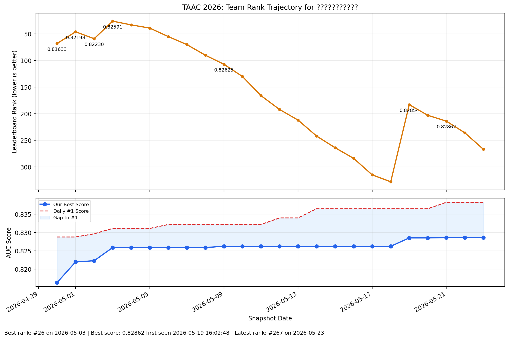

# 结果与排名背景

## 公开分数

下表列出历史记录中能够较清楚对应到公开榜的结果，并给出相对官方 baseline 的增量。

| 阶段 | 公开 AUC | 相对官方 baseline |
| --- | ---: | ---: |
| 官方 baseline | `约 0.812` | `+0.0000` |
| 样本级摘要特征工程版本 | `0.816` | `约 +0.0040` |
| 早期样本级元信息条件化版本 | `0.821977` | `约 +0.0100` |
| 离散日历时间版本 | `0.825905` | `约 +0.0139` |
| 训练策略强化版本 | `0.828537` | `约 +0.0165` |
| hash fallback 对照版本 | `0.827938` | `约 +0.0159` |

开源代码默认对应训练策略强化版本。

## 排名轨迹

仓库中保留了以下排名轨迹文件：

- 图片：[assets/team_rank_trajectory.png](../assets/team_rank_trajectory.png)
- 数据：[assets/team_rank_trajectory.csv](../assets/team_rank_trajectory.csv)

该轨迹主要用于保留比赛背景。它反映出三点：

1. 比赛后期本方案仍有公开分提升。
2. 榜单整体也在持续变化，因此名次变化不只由本地分数决定。
3. 分数提升与名次提升并不总是同步。

## 为什么选择当前开源版本

当前开源版本满足以下条件：

- 公开分数有清楚记录；
- train/eval 代码配对明确；
- 模型和训练设置能够形成完整说明；
- 有效实验和负结果都能连接到同一条主线。

因此，本仓库优先发布可解释、可追溯的方案版本，而不是发布来源不够清楚的最高私有尝试。
